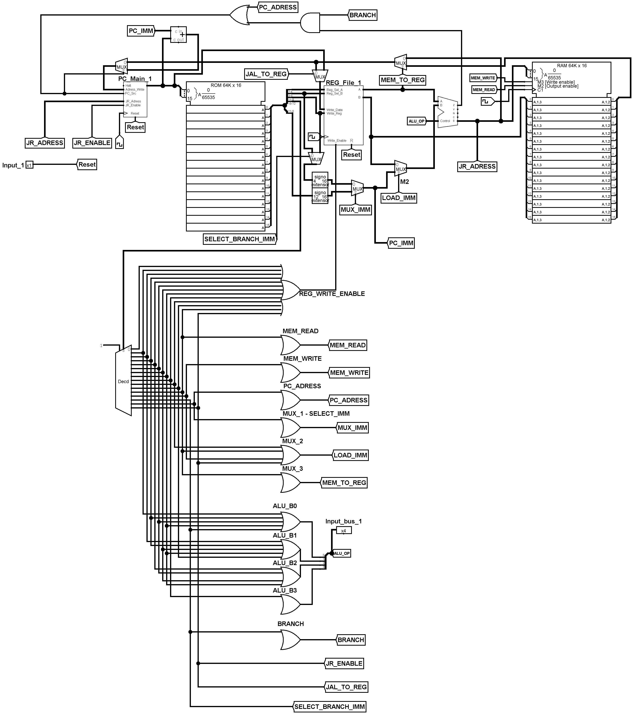
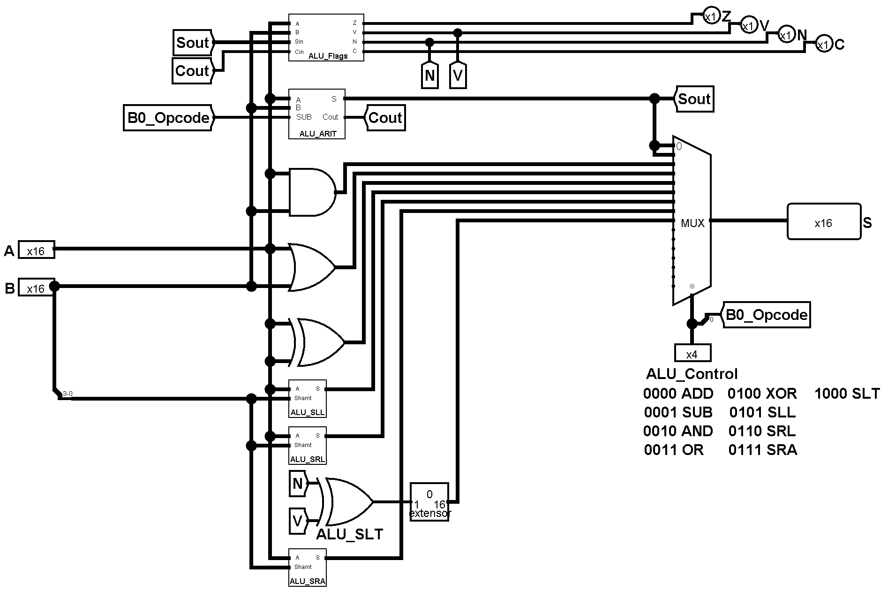
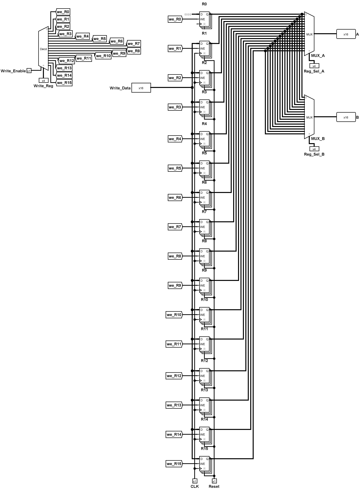
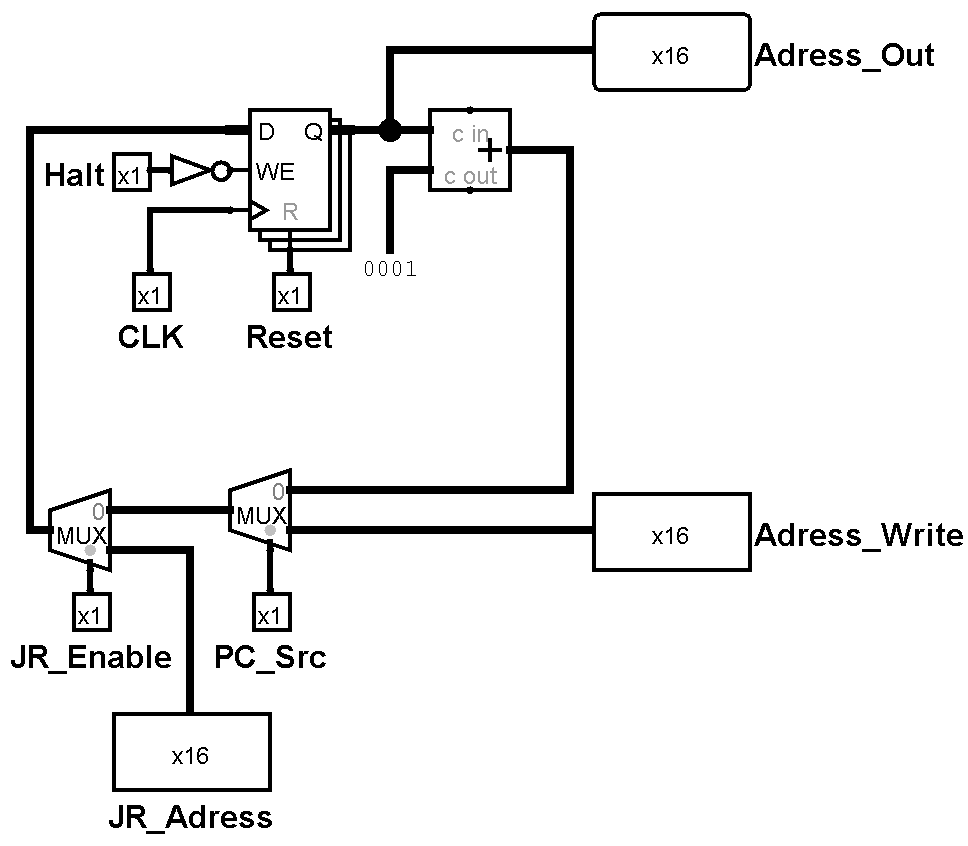

# Yet Another MCU From Scratch - 16b (YAMCUFS)

## What is this project?

As the name suggests, in this repository I built a complete 16-bit MCU (Microcontroller Unit) and its own Assembly language. Next on the list is its own programming language and finally I would like to make a mini-os.

## Hardware Design (Logisim)

The processor and its components were built from the ground up using Logisim-evolution. Below are the schematics of the main modules:

## Where to find Assembly instructions and more

You can find them in either en_yacpufs_16b.pdf or es_yacpufs_16b.pdf. The only
difference is the language

## ASM Example

Theres a file called fibonacci_calculator.asm, its intended to be compiled using the compiler
and then load the .hex into the ROM. After some clocks (recommend speeding it up on Logisim) you
will be able to see the Fibonacci Number with n = 23 in the 10th register (t2)

### Main System (YAMCUFS)

The complete Harvard architecture microcontroller, integrating the CPU core, instruction memory (ROM), and data memory (RAM).

### Arithmetic Logic Unit (ALU)

Handles all the mathematical and logical operations (ADD, SUB, AND, OR, XOR, shifts, and comparisons).

### Register File

Contains the 16 general-purpose 16-bit registers (R0 to R15), with R0 hardwired to zero.

### Program Counter (PC)

Controls the execution flow, instruction fetching, and branching/jumping logic.

